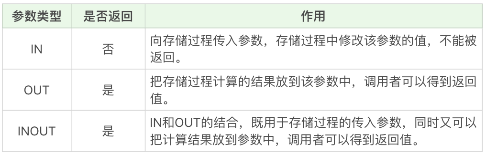

#### 创建一个存储过程
定义一个存储过程：
```
CREATE PROCEDURE 存储过程名称([参数列表])
BEGIN
    需要执行的语句
END    
```
计算 1+2+…+n 等于多少
```
DELIMITER //
CREATE PROCEDURE `add_num`(IN n INT)
BEGIN
       DECLARE i INT;
       DECLARE sum INT;
       
       SET i = 1;
       SET sum = 0;
       WHILE i <= n DO
              SET sum = sum + i;
              SET i = i +1;
       END WHILE;
       SELECT sum;
END //
DELIMITER ;

mysql> DELIMITER //
mysql> CREATE PROCEDURE `add_num`(IN n INT)
    -> BEGIN
    ->        DECLARE i INT;
    ->        DECLARE sum INT;
    ->
    ->        SET i = 1;
    ->        SET sum = 0;
    ->        WHILE i <= n DO
    ->               SET sum = sum + i;
    ->               SET i = i +1;
    ->        END WHILE;
    ->        SELECT sum;
    -> END //
Query OK, 0 rows affected (0.05 sec)

mysql> DELIMITER ;
mysql> CALL add_num(50);
+------+
| sum  |
+------+
| 1275 |
+------+
1 row in set (0.01 sec)

```
这就是一个简单的存储过程，除了理解 1+2+…+n 的实现过程，还有两点你需要理解，一个是 DELIMITER 定义语句的结束符，另一个是存储过程的三种参数类型。

默认情况下 SQL 采用（；）作为结束符，这样当存储过程中的每一句 SQL 结束之后，采用（；）作为结束符，就相当于告诉 SQL 可以执行这一句了。但是存储过程是一个整体，我们不希望 SQL 逐条执行，而是采用存储过程整段执行的方式，因此我们就需要临时定义新的 DELIMITER，新的结束符可以用（//）或者（$$）。

首先我用（//）作为结束符，又在整个存储过程结束后采用了（//）作为结束符号，告诉 SQL 可以执行了，然后再将结束符还原成默认的（;）。

如果你用的是 Navicat 工具，那么在编写存储过程的时候，Navicat 会自动设置 DELIMITER 为其他符号，我们不需要再进行 DELIMITER 的操作。

存储过程的 3 种参数类型:


创建一个存储类型 get_hero_scores，用来查询某一类型英雄中的最大的最大生命值，最小的最大魔法值，以及平均最大攻击值
```
DELIMITER //
CREATE PROCEDURE `get_hero_scores`(
       OUT max_max_hp FLOAT,
       OUT min_max_mp FLOAT,
       OUT avg_max_attack FLOAT,  
       s VARCHAR(255)
       )
BEGIN
       SELECT MAX(hp_max), MIN(mp_max), AVG(attack_max) FROM heros WHERE role_main = s INTO max_max_hp, min_max_mp, avg_max_attack;
END //
DELIMITER ;

mysql>  DELIMITER //
mysql> CREATE PROCEDURE `get_hero_scores`(
    ->        OUT max_max_hp FLOAT,
    ->        OUT min_max_mp FLOAT,
    ->        OUT avg_max_attack FLOAT,
    ->        s VARCHAR(255)
    ->        )
    -> BEGIN
    ->        SELECT MAX(hp_max), MIN(mp_max), AVG(attack_max) FROM heros WHERE role_main = s INTO max_max_hp, min_max_mp, avg_max_attack;
    -> END //
Query OK, 0 rows affected (0.02 sec)

mysql> DELIMITER ;
mysql> CALL get_hero_scores(@max_max_hp, @min_max_mp, @avg_max_attack, '战士');
Query OK, 1 row affected (0.01 sec)

mysql> SELECT @max_max_hp, @min_max_mp, @avg_max_attack;
+-------------+-------------+-------------------+
| @max_max_hp | @min_max_mp | @avg_max_attack   |
+-------------+-------------+-------------------+
|        8050 |           0 | 342.1666564941406 |
+-------------+-------------+-------------------+
1 row in set (0.00 sec)
```
从 heros 数据表中筛选主要英雄定位为 s 的英雄数据，即筛选条件为 role_main=s，提取这些数据中的最大的最大生命值，最小的最大魔法值，以及平均最大攻击值，分别赋值给变量 max_max_hp、min_max_mp 和 avg_max_attack。

#### 流控制语句
1. BEGIN…END：BEGIN…END 中间包含了多个语句，每个语句都以（;）号为结束符。
2. DECLARE：DECLARE 用来声明变量，使用的位置在于 BEGIN…END 语句中间，而且需要在其他语句使用之前进行变量的声明。
3. SET：赋值语句，用于对变量进行赋值。
4. SELECT…INTO：把从数据表中查询的结果存放到变量中，也就是为变量赋值。
5. IF…THEN…ENDIF：条件判断语句，我们还可以在 IF…THEN…ENDIF 中使用 ELSE 和 ELSEIF 来进行条件判断。
6. CASE：CASE 语句用于多条件的分支判断，使用的语法是下面这样的。
```
CASE 
  WHEN expression1 THEN ...
  WHEN expression2 THEN ...
  ...
    ELSE 
    --ELSE语句可以加，也可以不加。加的话代表的所有条件都不满足时采用的方式。
END
```
7. LOOP、LEAVE 和 ITERATE：LOOP 是循环语句，使用 LEAVE 可以跳出循环，使用 ITERATE 则可以进入下一次循环。如果你有面向过程的编程语言的使用经验，你可以把 LEAVE 理解为 BREAK，把 ITERATE 理解为 CONTINUE。
8. REPEAT…UNTIL…END REPEAT：这是一个循环语句，首先会执行一次循环，然后在 UNTIL 中进行表达式的判断，如果满足条件就退出，即 END REPEAT；如果条件不满足，则会就继续执行循环，直到满足退出条件为止。
9. WHILE…DO…END WHILE：这也是循环语句，和 REPEAT 循环不同的是，这个语句需要先进行条件判断，如果满足条件就进行循环，如果不满足条件就退出循环。

#### 关于存储过程使用的争议
**存储过程有很多好处。**<br>
首先存储过程可以一次编译多次使用。存储过程只在创造时进行编译，之后的使用都不需要重新编译，这就提升了 SQL 的执行效率。其次它可以减少开发工作量。将代码封装成模块，实际上是编程的核心思想之一，这样可以把复杂的问题拆解成不同的模块，然后模块之间可以重复使用，在减少开发工作量的同时，还能保证代码的结构清晰。还有一点，存储过程的安全性强，我们在设定存储过程的时候可以设置对用户的使用权限，这样就和视图一样具有较强的安全性。最后它可以减少网络传输量，因为代码封装到存储过程中，每次使用只需要调用存储过程即可，这样就减少了网络传输量。同时在进行相对复杂的数据库操作时，原本需要使用一条一条的 SQL 语句，可能要连接多次数据库才能完成的操作，现在变成了一次存储过程，只需要连接一次即可。

**存储过程虽然有诸如上面的好处，但缺点也是很明显的。**<br>
它的可移植性差，存储过程不能跨数据库移植，比如在 MySQL、Oracle 和 SQL Server 里编写的存储过程，在换成其他数据库时都需要重新编写。

其次调试困难，只有少数 DBMS 支持存储过程的调试。对于复杂的存储过程来说，开发和维护都不容易。

此外，存储过程的版本管理也很困难，比如数据表索引发生变化了，可能会导致存储过程失效。我们在开发软件的时候往往需要进行版本管理，但是存储过程本身没有版本控制，版本迭代更新的时候很麻烦。

最后它不适合高并发的场景，高并发的场景需要减少数据库的压力，有时数据库会采用分库分表的方式，而且对可扩展性要求很高，在这种情况下，存储过程会变得难以维护，增加数据库的压力，显然就不适用了。

#### test
针对王者荣耀的英雄数据表 heros 表，请编写存储过程 get_sum_score ，用来得到某一类型英雄（主要定位为某一类型即可）的最大生命值的总和。
```
DELIMITER //
CREATE PROCEDURE `get_sum_score`(
       OUT max_sum_hp FLOAT,  
       s VARCHAR(255)
       )
BEGIN
       SELECT sum(hp_max) FROM heros WHERE role_main = s INTO max_sum_hp;
END //
DELIMITER ;

mysql> DELIMITER //
mysql> CREATE PROCEDURE `get_sum_score`(
    ->        OUT max_sum_hp FLOAT,
    ->        s VARCHAR(255)
    ->        )
    -> BEGIN
    ->        SELECT sum(hp_max) FROM heros WHERE role_main = s INTO max_sum_hp;
    -> END //
Query OK, 0 rows affected (0.02 sec)

mysql> DELIMITER ;
mysql> call get_sum_score(@sum,'法师');
Query OK, 1 row affected (0.00 sec)

mysql> select @sum;
+--------+
| @sum   |
+--------+
| 111317 |
+--------+
1 row in set (0.00 sec)
```