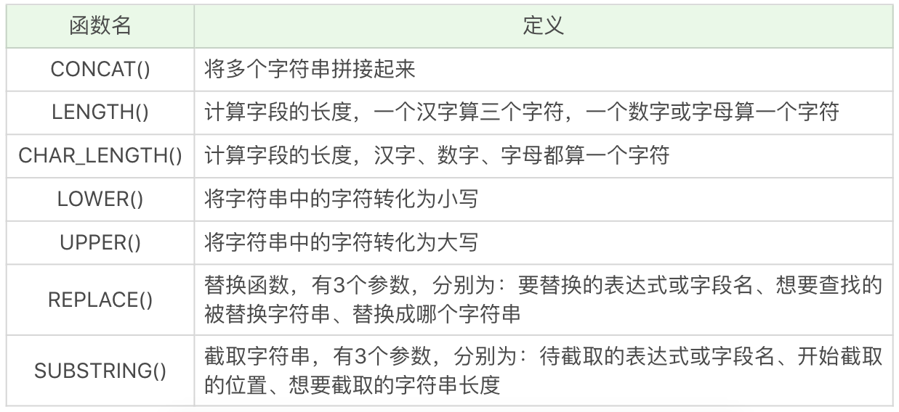
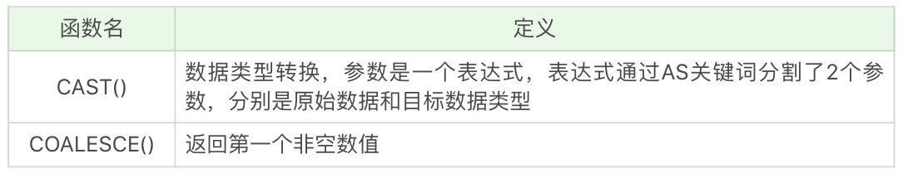

### 常用的 SQL 函数
可以把内置函数分成四类：<br>
1. 算术函数(算术处理)
2. 字符串函数(字符串处理)
3. 日期函数(日期处理)
4. 转换函数(数据类型转换)<br>

原因：<br>
函数是对提取出来的数据进行操作，那么数据表中字段类型的定义有哪几种呢？我们经常会保存一些数值，不论是整数类型，还是浮点类型，实际上对应的就是数值类型。同样我们也会保存一些文本内容，可能是人名，也可能是某个说明，对应的就是字符串类型。此外我们还需要保存时间，也就是日期类型。那么针对数值、字符串和日期类型的数据，我们可以对它们分别进行算术函数、字符串函数以及日期函数的操作。如果想要完成不同类型数据之间的转换，就可以使用转换函数。

#### 算术函数

<br>
SELECT ABS(-2)，运行结果为 2。<br>
SELECT MOD(101,3)，运行结果 2。<br>
SELECT ROUND(37.25,1)，运行结果 37.3。<br>

#### 字符串函数

<br>
SELECT CONCAT('abc', 123)，运行结果为 abc123。<br>
SELECT LENGTH('你好')，运行结果为 6。<br>
SELECT CHAR_LENGTH('你好')，运行结果为 2。<br>
SELECT LOWER('ABC')，运行结果为 abc。<br>
SELECT UPPER('abc')，运行结果 ABC。<br>
SELECT REPLACE('fabcd', 'abc', 123)，运行结果为 f123d。<br>
SELECT SUBSTRING('fabcd', 1,3)，运行结果为 fab。<br>

#### 日期函数
<br>
SELECT CURRENT_DATE()，运行结果为 2019-04-03。<br>
SELECT CURRENT_TIME()，运行结果为 21:26:34。<br>
SELECT CURRENT_TIMESTAMP()，运行结果为 2019-04-03 21:26:34。<br>
SELECT EXTRACT(YEAR FROM '2019-04-03')，运行结果为 2019。<br>
SELECT DATE('2019-04-01 12:00:05')，运行结果为 2019-04-01。<br>

需要注意的是，DATE 日期格式必须是 yyyy-mm-dd 的形式。如果要进行日期比较，就要使用 DATE 函数，不要直接使用日期与字符串进行比较。

#### 转换函数
<br>
SELECT CAST(123.123 AS INT)，运行结果会报错。<br>
SELECT CAST(123.123 AS DECIMAL(8,2))，运行结果为 123.12。<br>
SELECT COALESCE(null,1,2)，运行结果为 1。<br>

CAST 函数在转换数据类型的时候，不会四舍五入，如果原数值有小数，那么转换为整数类型的时候就会报错。不过你可以指定转化的小数类型，在 MySQL 和 SQL Server 中，你可以用DECIMAL(a,b)来指定，其中 a 代表整数部分和小数部分加起来最大的位数，b 代表小数位数，比如DECIMAL(8,2)代表的是精度为 8 位（整数加小数位数最多为 8 位），小数位数为 2 位的数据类型。所以SELECT CAST(123.123 AS DECIMAL(8,2))的转换结果为 123.12。
```
mysql> SELECT CAST(123.123 AS DECIMAL(8,2));
+-------------------------------+
| CAST(123.123 AS DECIMAL(8,2)) |
+-------------------------------+
|                        123.12 |
+-------------------------------+

mysql> SELECT CAST(123.129 AS DECIMAL(8,2));
+-------------------------------+
| CAST(123.129 AS DECIMAL(8,2)) |
+-------------------------------+
|                        123.13 |
+-------------------------------+
```
#### 王者荣耀英雄数据练习
```
mysql> SELECT name, attack_growth FROM heros;
+----------+---------------+
| name     | attack_growth |
+----------+---------------+
| 夏侯惇   |         11.57 |
| 钟无艳   |            11 |
| 张飞     |         10.57 |
| 牛魔     |         8.357 |
| 吕布     |         12.36 |
| 亚瑟     |            13 |

mysql> SELECT name, ROUND(attack_growth,1) FROM heros;
+----------+------------------------+
| name     | ROUND(attack_growth,1) |
+----------+------------------------+
| 夏侯惇   |                   11.6 |
| 钟无艳   |                   11.0 |
| 张飞     |                   10.6 |
| 牛魔     |                    8.4 |
| 吕布     |                   12.4 |
| 亚瑟     |                   13.0 |

假如我们想要知道最大生命值最大的是哪个英雄，以及对应的数值，就需要分成两个步骤来处理：首先找到英雄的最大生命值的最大值，即SELECT MAX(hp_max) FROM heros，然后再筛选最大生命值等于这个最大值的英雄
mysql> SELECT name, hp_max FROM heros WHERE hp_max = (SELECT MAX(hp_max) FROM heros);
+------+--------+
| name | hp_max |
+------+--------+
| 廉颇 |   9328 |
+------+--------+

mysql> SELECT CHAR_LENGTH(name), name FROM heros;
+-------------------+----------+
| CHAR_LENGTH(name) | name     |
+-------------------+----------+
|                 3 | 夏侯惇   |
|                 3 | 钟无艳   |
|                 2 | 张飞     |
|                 2 | 牛魔     |
|                 2 | 吕布     |
|                 2 | 亚瑟     |
|                 2 | 芈月     |

假如想要提取英雄上线日期（对应字段 birthdate）的年份，只显示有上线日期的英雄即可（有些英雄没有上线日期的数据，不需要显示），这里我们需要使用 EXTRACT 函数，提取某一个时间元素。所以我们需要筛选上线日期不为空的英雄，即WHERE birthdate is not null，然后再显示他们的名字和上线日期的年份
mysql> SELECT name, EXTRACT(YEAR FROM birthdate) AS birthdate FROM heros WHERE birthdate is NOT NULL;
+----------+-----------+
| name     | birthdate |
+----------+-----------+
| 夏侯惇   |      2016 |
| 牛魔     |      2015 |
| 吕布     |      2015 |
| 芈月     |      2015 |
| 东皇太一 |      2017 |
| 太乙真人 |      2016 |
| 刘邦     |      2016 |
| 关羽     |      2016 |

另一种写法：
mysql> SELECT name, YEAR(birthdate) AS birthdate FROM heros WHERE birthdate is NOT NULL;
+----------+-----------+
| name     | birthdate |
+----------+-----------+
| 夏侯惇   |      2016 |
| 牛魔     |      2015 |
| 吕布     |      2015 |
| 芈月     |      2015 |
| 东皇太一 |      2017 |
| 太乙真人 |      2016 |
| 刘邦     |      2016 |
| 关羽     |      2016 |

假设我们需要找出在 2016 年 10 月 1 日之后上线的所有英雄。这里我们可以采用 DATE 函数来判断 birthdate 的日期是否大于 2016-10-01，即WHERE DATE(birthdate)>'2016-10-01'，然后再显示符合要求的全部字段信息
mysql> SELECT name FROM heros WHERE DATE(birthdate)>'2016-10-01';
+----------+
| name     |
+----------+
| 东皇太一 |
| 太乙真人 |
| 干将莫邪 |
| 大乔     |
| 鬼谷子   |
| 杨戬     |
| 哪吒     |
| 百里守约 |
+----------+
下面这种写法是不安全的：

SELECT * FROM heros WHERE birthdate>'2016-10-01';
因为很多时候你无法确认 birthdate 的数据类型是字符串，还是 datetime 类型，如果你想对日期部分进行比较，那么使用DATE(birthdate)来进行比较是更安全的。

假设我们需要知道在 2016 年 10 月 1 日之后上线英雄的平均最大生命值、平均最大法力和最高物攻最大值。同样我们需要先筛选日期条件，即WHERE DATE(birthdate)>'2016-10-01'，然后再选择AVG(hp_max), AVG(mp_max), MAX(attack_max)字段进行显示。
mysql> SELECT AVG(hp_max), AVG(mp_max), MAX(attack_max) FROM heros WHERE DATE(birthdate)>'2016-10-01';
+-------------+-------------+-----------------+
| AVG(hp_max) | AVG(mp_max) | MAX(attack_max) |
+-------------+-------------+-----------------+
|      6611.5 |      1821.5 |             410 |
+-------------+-------------+-----------------+
```

### 为什么使用 SQL 函数会带来问题
但我们在使用 SQL 语言的时候，不是直接和这门语言打交道，而是通过它使用不同的数据库软件，即 DBMS。DBMS 之间的差异性很大，远大于同一个语言不同版本之间的差异。实际上，只有很少的函数是被 DBMS 同时支持的。比如，大多数 DBMS 使用（||）或者（+）来做拼接符，而在 MySQL 中的字符串拼接函数为Concat()。大部分 DBMS 会有自己特定的函数，这就意味着采用 SQL 函数的代码可移植性是很差的，因此在使用函数的时候需要特别注意。

#### 关于大小写的规范
MySQL 在 Linux 的环境下，数据库名、表名、变量名是严格区分大小写的，而字段名是忽略大小写的。<br>
MySQL 在 Windows 的环境下全部不区分大小写。<br>

命名规范的建议：<br>
1. 关键字和函数名称全部大写；
2. 数据库名、表名、字段名称全部小写；
3. SQL 语句必须以分号结尾。

虽然关键字和函数名称在 SQL 中不区分大小写，也就是如果小写的话同样可以执行，但是数据库名、表名和字段名在 Linux MySQL 环境下是区分大小写的，因此建议你统一这些字段的命名规则，比如全部采用小写的方式。同时将关键词和函数名称全部大写，以便于区分数据库名、表名、字段名。


